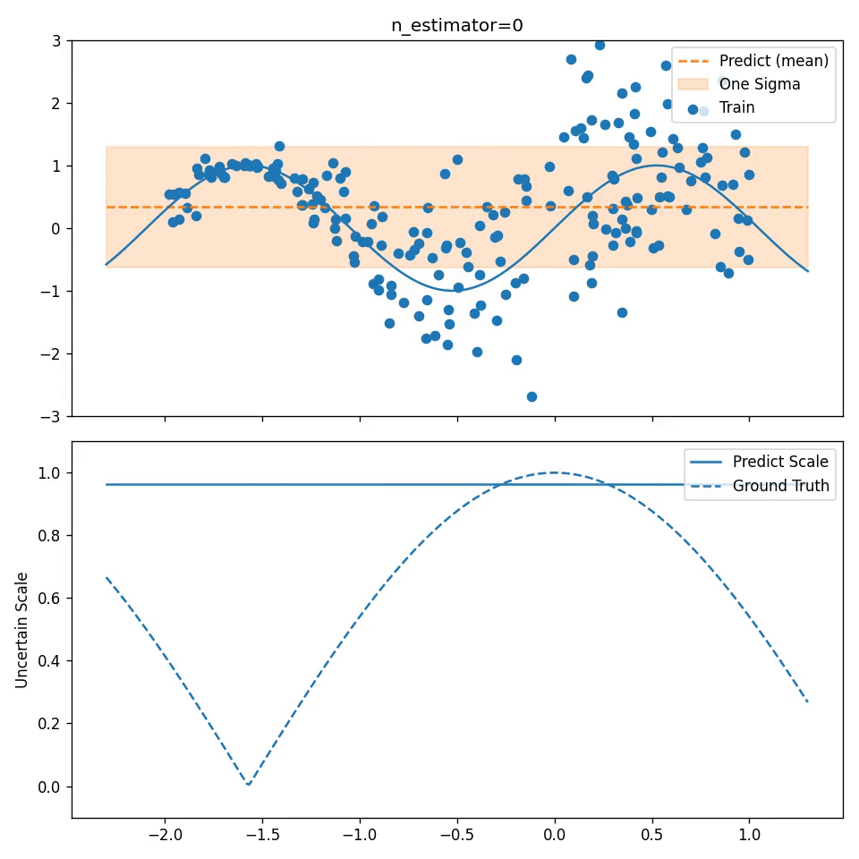

# NGBoost

Simple NGBoost (Natural Gradient Boosting for Probabilistic Prediction) Implementation.

* Original: https://github.com/stanfordmlgroup/ngboost
* paper: https://arxiv.org/abs/1910.03225

## Quick Start

Install Docker and docker-compose on your local machine.

```bash
docker-compose up -d --build

docker exec -it ngboost-jupyter bash
```

## Run

```bash
python ngboost.py
```

### Conditions

* Data: Artificial Data
    * Input: 1-dimension
    * Target: `true_function` + random noise scaled by input X
* NGBoost Parameters:
    * Weak Learner: Decision Tree
    * Distribution: Normal Distribution
        * re-parameterized \theta = ln (var (i.e. \sigma^2))
    * Use Natural Gradient 
    * `n_estimators`: 500
    * `learning_rate` 1e-2

### Result

